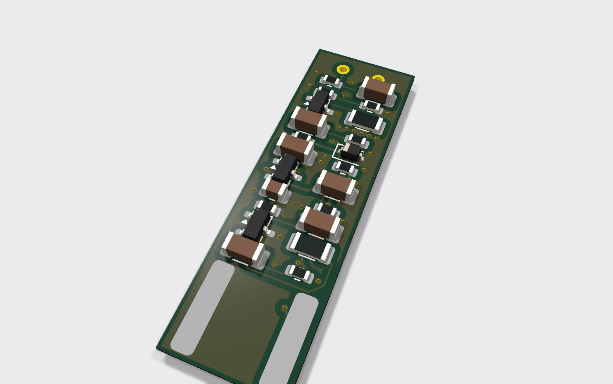
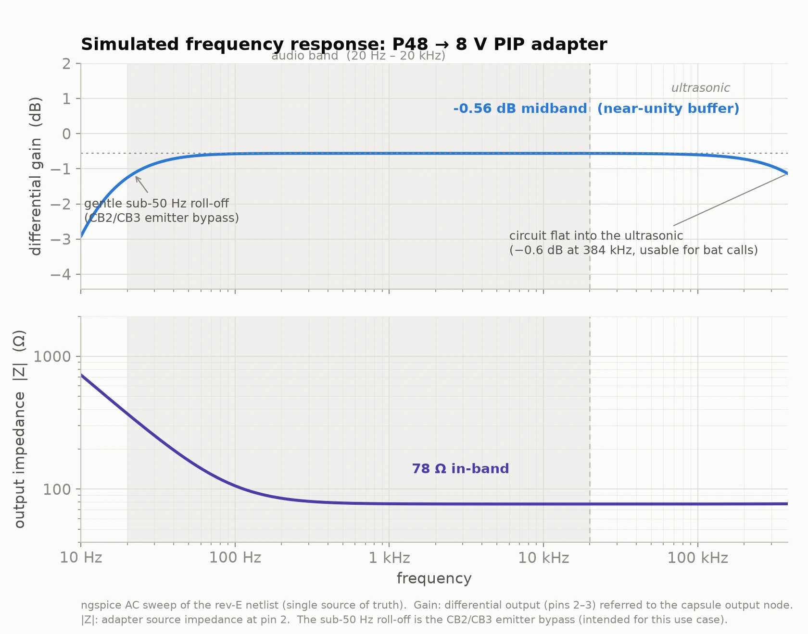
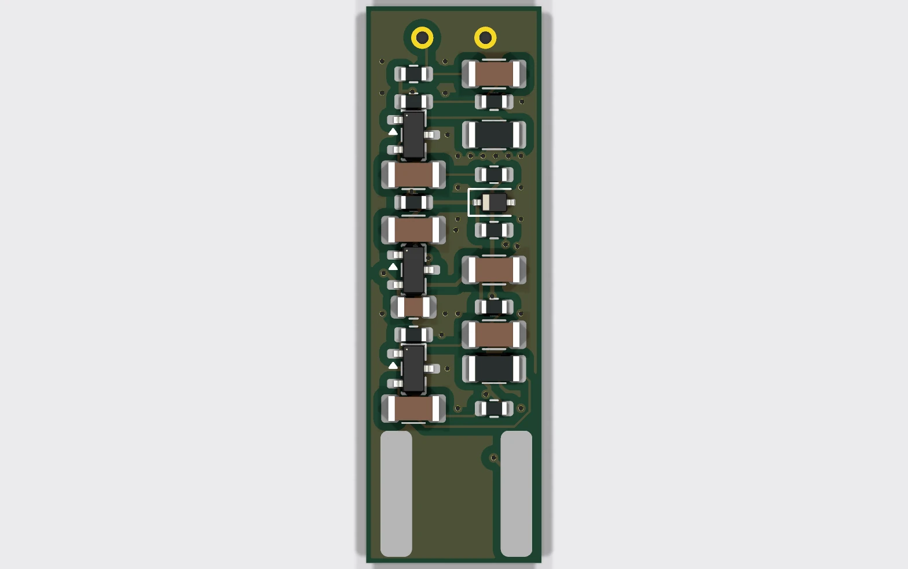
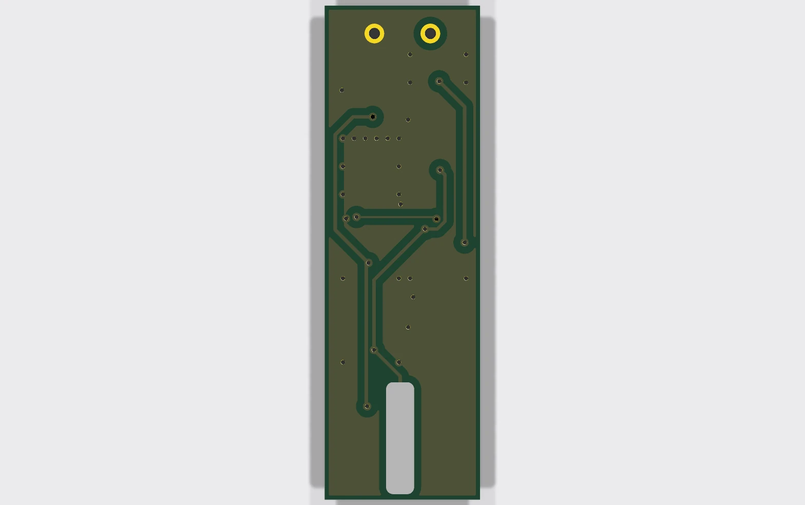
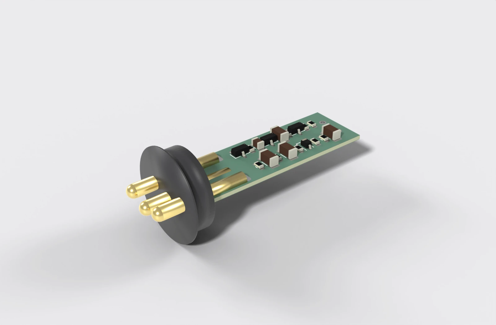
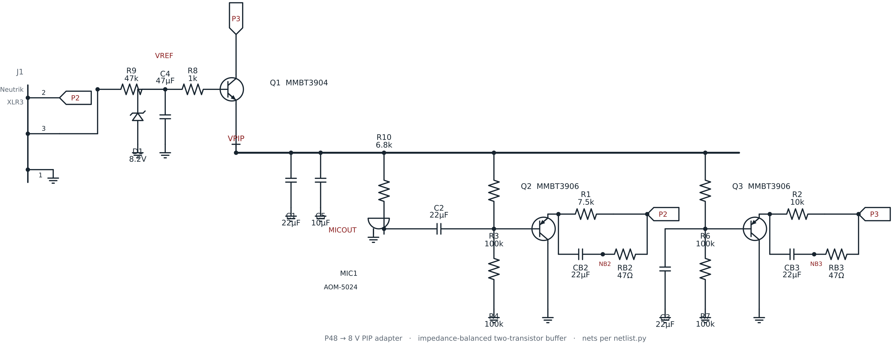
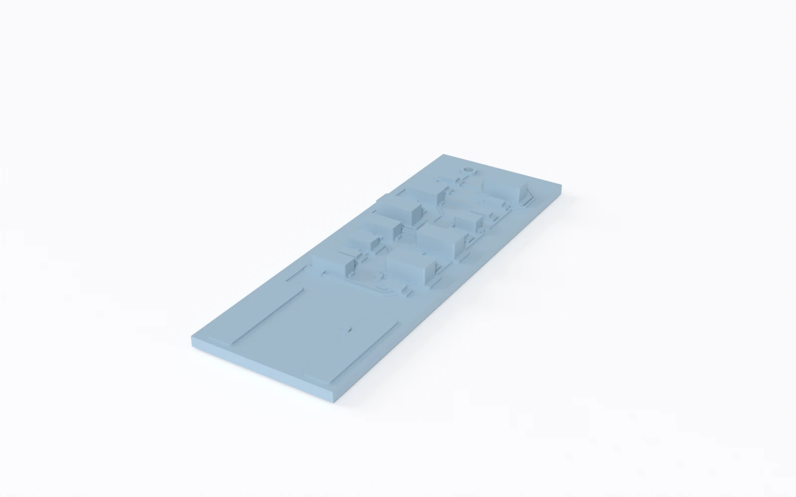

# P48 → 8 V PIP adapter (fits inside an XLR connector)

An ultra-compact **phantom-power (24-48 V) to 8 V plug-in-power (PIP)** adapter
board for high-sensitivity electret condenser capsules such as the PUI Audio
**AOM-5024**. The whole circuit lives on a **11.1 × 35.3 × 0.8 mm** four-layer
PCB thin enough to slip *between* the pins of a Neutrik **NC3MXX** male XLR and
solder to them directly, so a two-wire electret becomes a self-contained,
buffered, impedance-balanced phantom mic with nothing hanging off the back. It
runs on standard phantom power from any mixer, audio interface (such as a
Focusrite Scarlett), or field recorder.



This is the active-electronics counterpart to the 3D-printed
[`aom5024-xlr`](https://github.com/tphakala/aom5024-xlr) pencil-mic housing.
That project runs the capsule on a bare resistor + capacitor (fine for short
cable runs); this board is the buffered, impedance-balanced front end it points
to for long cables and true common-mode rejection, squeezed onto a board that
still fits inside the connector.

> **Order the bare board as 0.8 mm thick.** The thin edge has to fit into the
> gap between the three Neutrik pins; a standard 1.6 mm board is far too thick.
> This is a deliberate, load-bearing spec, not a default you can ignore.

## How it works

The circuit is three parts, one per section below: a capacitance-multiplier
supply that cleans up the phantom rail, a matched pair of Class-A buffers that
drive the cable, and a current split that keeps the DC draw equal on both
phantom pins.

### 1. Power supply: capacitance multiplier

Rather than running the capsule off a noisy Zener directly, the supply is a
**capacitance multiplier**:

- Phantom power is tapped equally from XLR pins 2 and 3.
- An 8.2 V Zener (D1) sets a raw voltage reference.
- A large RC low-pass (100 kΩ + 22 µF) puts the corner well below 1 Hz,
  scrubbing the Zener's avalanche noise off the reference.
- An NPN emitter follower (Q1) buffers that silent reference to the ~7.5 V
  PIP rail that biases the capsule.

### 2. Audio stage: impedance-balanced Class-A buffer

A two-wire electret can't produce a true differential signal on its own, so the
board fakes a balanced line the preamp can't tell from the real thing:

- **Pin 2 (hot)** is driven by a PNP emitter follower (Q2), a Class-A buffer
  that converts the capsule's high output impedance to a low ~78 Ω that
  drives long cable without treble roll-off.
- **Pin 3 (cold)** uses an identical PNP (Q3) with its base AC-grounded: no
  audio, but it matches Q2's ~78 Ω output impedance exactly.
- To the preamp this looks like a balanced source, so common-mode hum and RF
  cancel.

### 3. DC current balancing

The circuit pulls roughly **3 mA per pin**, a balanced DC draw that suits any
balanced input, whether electronically balanced (most audio interfaces and
modern preamps) or transformer-coupled: pin 2 feeds the hot buffer (Q2); pin 3
feeds the cold buffer (Q3) plus the regulator.

## Simulated performance

The circuit is verified headlessly in **ngspice**. The deck is generated from
[`netlist.py`](netlist.py) — the same single source of truth as the board and
schematic — so the simulation can't drift from the hardware. `sim/run.ps1`
range-checks 17 design assertions; `sim/plot_response.py` sweeps the wide-band
response below (10 Hz – 384 kHz).



- **Flat through the audio band** at −0.56 dB (a near-unity buffer), driving a
  modelled ~30 m cable into a 2 kΩ preamp.
- **Flat well into the ultrasonic** — only ~0.6 dB down at **384 kHz** (the
  192 kHz Nyquist of a 384 kHz sample rate). The trace is referred to the
  capsule output node, so it shows the *adapter electronics in isolation*: with
  a wide-band capsule the circuit is not the bottleneck for ultrasonic work such
  as **bat-call recording**. (The stock AOM-5024 electret rolls off far earlier
  — swap it for an ultrasonic-capable capsule for that use.)
- **~78 Ω source impedance**, flat from the audio band into the ultrasonic — low
  enough to drive long cable without HF loss and to look benign to any balanced
  input.
- The **gentle sub-50 Hz roll-off** is the CB2/CB3 emitter bypass, and it is
  deliberate — some LF attenuation is desirable here and it keeps those bypass
  caps small.

See [`sim/README.md`](sim/README.md) for the harness and the full assertion list.

## The board

Four copper layers, everything on the **top** side for single-sided assembly.
The two inner layers are **solid ground planes** — a real on-board Faraday cage
for the µV front end, via-stitched to the outer ground pours and to the XLR
pin-1 ground, backing up the grounded zinc shell:

| Layer | Net / role |
| :-- | :-- |
| **F.Cu** | signal routing + all component placement, GND flood-fill |
| **In1.Cu** | solid ground plane (shield / image plane under the signal) |
| **In2.Cu** | solid ground plane (second reference for the back-side routing) |
| **B.Cu** | GND pour + the few signal escapes + the XLR pin-3 pad |

Signal routing is confined to the outer layers so the inner planes stay
unbroken; the supply nets (P2/P3/VPIP/VREF) use a wider 0.25 mm **Power**
netclass, while GND is distributed by the planes rather than as tracks.



### XLR sandwich mount

The thin board edge slides **between** the three NC3MXX pins (7.62 mm cup
spacing) and the pins solder to the board faces, pins 1 and 2 on the front and
pin 3 on the back:

| Pin | Net | Face | x (mm) |
| :-- | :-- | :-- | :-- |
| 1 | GND | front | 1.90 |
| 2 | hot | front | 9.52 |
| 3 | cold | back | 5.71 |



The three XLR pads are **8 mm long**: the internal Neutrik pin runs ~5 mm along
the board and the pad extends 3 mm past the pin tip so there's copper to hand-
solder to. The pin tip keeps ≥ 5 mm clearance to the nearest component; the
35.3 mm board length is *derived* from that constraint in `netlist.py`.

The board's thin edge slots straight **between** the three XLR pins (pins 1 & 2
against the front component face, pin 3 against the back), with the pad end
seated against the connector body and the mating pins left free for the preamp.



<sub>The bare pin insert is modelled at this board's actual XLR-pad positions
(from `netlist.py`) to show the sandwich mount; the Neutrik NC3MXX STEP is one
fused solid whose pins can't be isolated, so the pins are drawn to match.</sub>

## Schematic

The full circuit, drawn from [`netlist.py`](netlist.py), the single source of
truth. On the left, the capacitance-multiplier reference/regulator (D1 zener,
R9/C4 sub-1 Hz filter, Q1 emitter follower) produces the clean **VPIP** rail; R10
biases the capsule; and the two impedance-matched PNP emitter followers (Q2 hot,
Q3 cold) draw the balanced ~3 mA per phantom pin, each with its CBx/RBx emitter-
bypass network for the low-Z output. This figure is drawn directly from the same
netlist that synthesizes the board, so the two cannot disagree.



## Bill of materials

All parts are SMD to fit the 11.1 mm width. Component values are nominal
(derived from the architecture and standard P48→PIP practice) and may benefit
from bench tuning before a production run.

| Ref | Value | Package | Function |
| :-- | :-- | :-- | :-- |
| Q1 | MMBT3904 | SOT-23 | NPN, regulator emitter follower |
| Q2, Q3 | MMBT3906 | SOT-23 | PNP, hot / cold audio buffers |
| D1 | 8.2 V Zener | SOD-323 | voltage reference |
| C1, C2, C3 | 22 µF 50 V | 1206 | filtering / DC blocking |
| C4 | 47 µF 50 V | 1206 | VREF filter (sub-1 Hz corner) |
| C5 | 10 µF 16 V | 0805 | PIP rail bypass |
| CB2, CB3 | 22 µF 50 V X7R | 1206 | emitter bypass → low-Z output |
| R1 | 7.5 kΩ | 1206 | hot buffer emitter feed (thermal, 1206) |
| R2 | 10 kΩ | 1206 | cold buffer emitter feed (thermal, 1206) |
| R3, R4, R6, R7 | 100 kΩ | 0603 | bias dividers |
| R8 | 1 kΩ | 0603 | regulator base stopper |
| R9 | 47 kΩ | 0603 | VREF feed |
| R10 | 6.8 kΩ | 0603 | mic bias |
| RB2, RB3 | 47 Ω | 0603 | emitter-bypass series stopper (cable stability) |

R1/R2 are **1206** (not 0603): each dissipates continuously inside the sealed
XLR shell, and 1206's 250 mW rating keeps a comfortable margin at 80 °C ambient.
CB2/CB3 sit across ~23 V DC, so they **must be 50 V rated** (X7R). There is
intentionally **no R5**. The full derived netlist (the single source of truth)
lives in [`netlist.py`](netlist.py) and is documented in [SPEC.md](SPEC.md); the
board is synthesized from it (schematic-free) and the schematic figure above is
drawn from the same netlist, so they cannot disagree.

## Manufacturing status

- **4-layer, 11.1 × 35.3 × 0.8 mm**, all parts top-side (single-sided assembly).
- **DRC: 0 errors, 0 unconnected pads, 0 footprint errors** (`kicad-cli pcb drc`).
- Track 0.15 mm (0.25 mm on the Power netclass), clearance 0.125 mm, vias
  0.6 / 0.3 mm, copper-to-edge ≥ 0.25 mm, solid In1/In2 ground planes with GND
  via stitching — all within JLCPCB / PCBWay standard 4-layer capability.
- Fab package: Gerber X2 + Excellon drill (PTH/NPTH separated) in
  [`Gerbers_PCBWay/`](Gerbers_PCBWay), zipped as `P48_Adapter_PCBWay.zip`.

**Known trade-off.** At 11.1 mm wide with six 1206 caps and two 1206 resistors,
the KiCad *courtyards* (assembly keep-out margins, ~4.7 mm for a 1206) unavoidably
overlap. There are no copper shorts (pad-to-pad clearance is fully enforced), so
the `courtyards_overlap` rule is downgraded to a warning. To remove it entirely,
move the 1206 parts to smaller packages or widen the board. Silkscreen reference
designators are hidden (illegible at this density); use the BOM and placement
data for assembly.

## Mechanical fit test

Before committing to a fab run, print `fit_test/p48_fittest.stl` and check the
board actually fits inside your connector. It's a single manifold solid: the
exact 0.8 mm outline, capsule through-holes, every component embossed at true
body size and height, raised solder pads, and the three long flat XLR solder
pads running along the board from the connector edge. Print flat, components up.



### Soldering to the connector

The board mounts as a sandwich between the Neutrik pins: pins 1 and 2 solder to
the front face, pin 3 to the back. Verified geometry (official KiCad Neutrik
NC3FAAV footprint, corroborated by the printed fit test) — pins 1 and 2 are
coplanar and 7.62 mm apart; pin 3 is centred 4.45 mm off their plane. With the
~3 mm solder cups and the 0.8 mm board, pin 3 clears by only ~1.4 mm — about
0.6 mm of total slack — so when the board is seated flush against pins 1 and 2,
the pin-3 cup sits roughly 0.5–0.7 mm off its back-face pad and needs a
deliberately fat fillet to bridge the gap.

Solder in this order:

1. **Pre-tin** the pin-3 back-face pad **and** the pin-3 solder cup separately.
2. Seat the board flush against pins 1 and 2 and **solder those two joints
   first** — they set the board position.
3. **Bridge pin 3 last**, reflowing both pre-tinned surfaces into one fat fillet
   across the ~0.6 mm gap.

Soldering pins 1 and 2 before pin 3 keeps the board from being stressed while
it is wedged between the cups.

## Automated build pipeline

The whole board is generated headlessly from `netlist.py`, with no manual KiCad
editing. Steps that touch `pcbnew` run under KiCad's bundled Python; the rest
run under any Python 3.

```bash
KPY="$LOCALAPPDATA/Programs/KiCad/10.0/bin/python.exe"

"$KPY" route.py            # build a pristine board + route it (build_pcb + Freerouting)
python export_gerbers.py   # Gerbers + drill -> Gerbers_PCBWay/ + zip
python gen_fittest.py      # 3D-printable fit-test STL
python scripts/render_previews.py   # regenerate the images/ previews
```

- **`build_pcb.py`**: schematic-free board synthesis. Loads standard + custom
  (XLR / capsule) footprints, assigns every pad to its net, sets the 4-layer
  stackup, the Power netclass and design rules, draws the outline, places all
  parts with a collision-checked parametric auto-placer (two columns, all
  top-side), lays the solid In1/In2 GND planes and pours, and drops the GND
  stitch + pad-fanout via grid.
- **`route.py`**: regenerates a pristine board, exports a Specctra DSN,
  **relabels the inner layers as plane layers** so signal routing stays on the
  outer copper and the GND planes stay unbroken, runs **Freerouting fully
  headless** (`-Djava.awt.headless=true` + `gui.enabled=false`, no window ever
  opens), imports the routes with a built-in SES parser, then floods F.Cu/B.Cu
  with GND and refills. Result: 100 % routed, 0 unconnected.
- **`export_gerbers.py`**: Gerber X2 + Excellon via `kicad-cli`, zipped for fab.
- **`gen_fittest.py`**: extracts the routed geometry into the fit-test STL.
- **`scripts/render_previews.py`**: the preview images above, from the board
  (kicad-cli raytracer) and the fit-test STL (Blender).
- **`scripts/render_connector.py`**: the sandwich-mount render. Exports the
  board to GLB and renders it in Blender between three modelled gold pins placed
  at the board's real XLR-pad positions (no third-party connector model needed).
- **`scripts/gen_schematic.py`**: the wired schematic figure, drawn from
  `netlist.py` with schemdraw (SVG → WebP via Inkscape). This is the schematic
  of record — the board is synthesized directly from the netlist, so there is no
  separate hand-drawn KiCad schematic to fall out of sync.

### Toolchain

Built with **KiCad 10**, `kicad-cli`, **Freerouting**, **Blender** (previews)
and **OpenSCAD** (fit-test model). Tool paths in the scripts are set for the
author's Windows install (`route.py`, `export_gerbers.py`); adjust them, or set
the `KICAD_CLI` / `BLENDER` environment variables the render script reads, for
your own machine.

## Design notes

Dimensional provenance, the full derived netlist, and the reasoning behind the
placement and design rules live in [SPEC.md](SPEC.md).

## License

[CC BY-NC 4.0](LICENSE) (Creative Commons Attribution-NonCommercial). You are
free to build, modify and share this design with attribution.
**Commercial use is not permitted.** Do not sell this board, assembled units,
or derivatives of the design.
