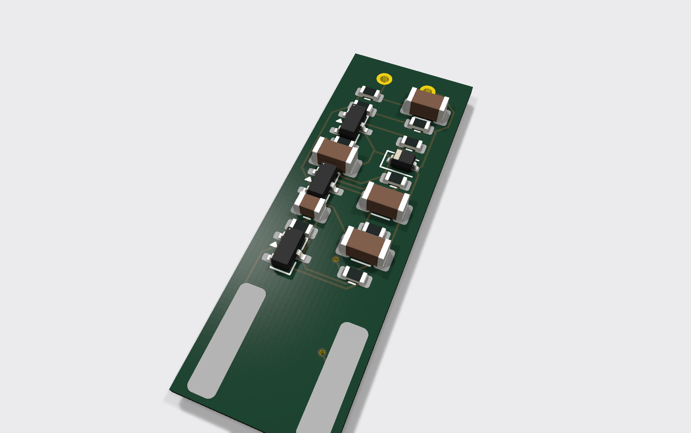
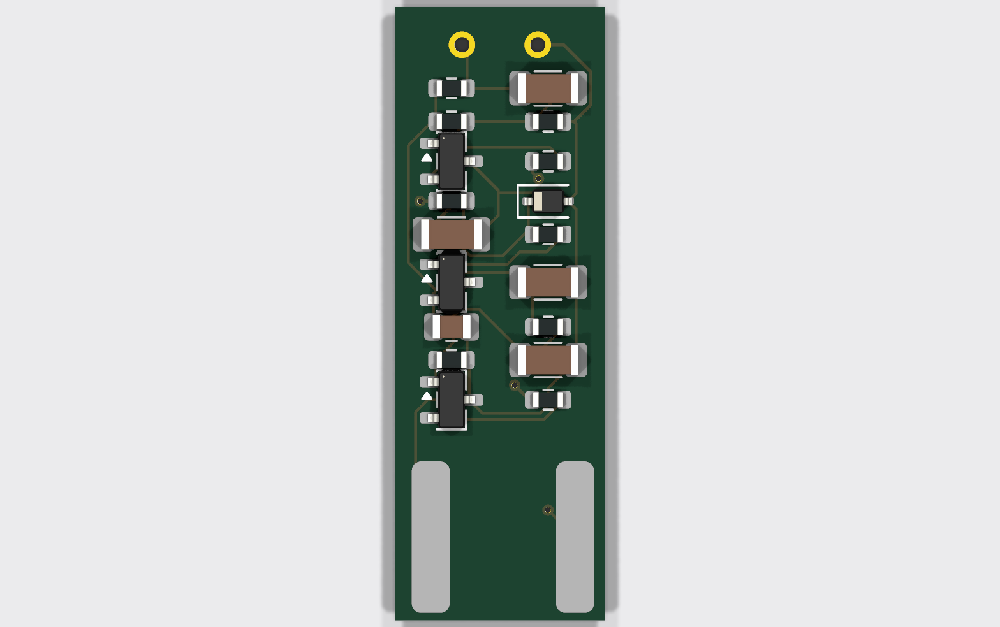
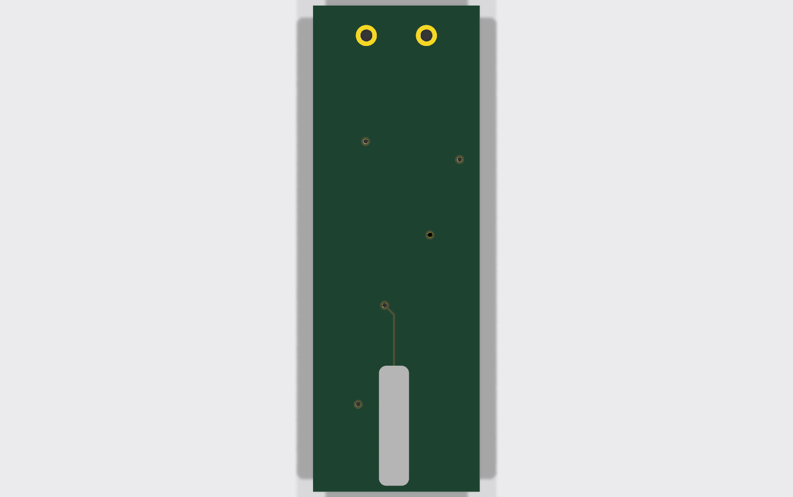
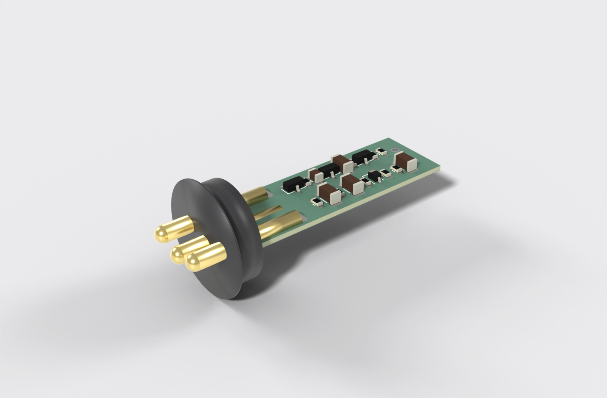
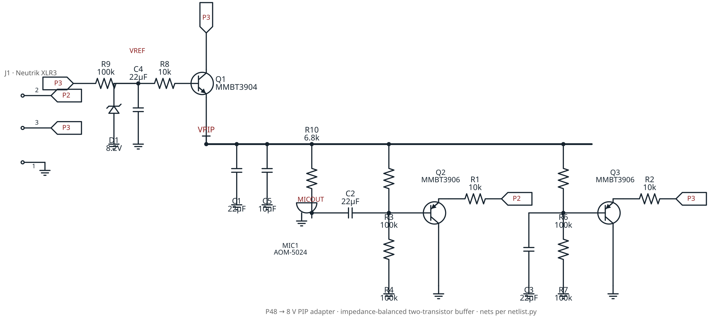

# P48 → 8 V PIP adapter (fits inside an XLR connector)

An ultra-compact **phantom-power (24–48 V) to 8 V plug-in-power (PIP)** adapter
board for high-sensitivity electret condenser capsules such as the PUI Audio
**AOM-5024**. The whole circuit lives on a **11.1 × 32.4 × 0.8 mm** four-layer
PCB thin enough to slip *between* the pins of a Neutrik **NC3MXX** male XLR and
solder to them directly — so a two-wire electret becomes a self-contained,
buffered, impedance-balanced phantom mic with nothing hanging off the back.



This is the active-electronics counterpart to the 3D-printed
[`aom5024-xlr`](https://github.com/tphakala/aom5024-xlr) pencil-mic housing.
That project runs the capsule on a bare resistor + capacitor (fine for short
cable runs); this board is the buffered, impedance-balanced front end it points
to for long cables and true common-mode rejection — squeezed onto a board that
still fits inside the connector.

> **Order the bare board as 0.8 mm thick.** The thin edge has to fit into the
> gap between the three Neutrik pins; a standard 1.6 mm board is far too thick.
> This is a deliberate, load-bearing spec, not a default you can ignore.

## How it works

The adapter uses a symmetrical two-transistor architecture that delivers clean
power and a robust, cable-driving output while drawing perfectly balanced DC
current from the mixer.

### 1. Power supply — capacitance multiplier

Rather than running the capsule off a noisy Zener directly, the supply is a
**capacitance multiplier**:

- Phantom power is tapped equally from XLR pins 2 and 3.
- An 8.2 V Zener (D1) sets a raw voltage reference.
- A large RC low-pass (100 kΩ + 22 µF) puts the corner well below 1 Hz,
  scrubbing the Zener's avalanche noise off the reference.
- An NPN emitter follower (Q1) buffers that silent reference to the ~7.5 V
  PIP rail that biases the capsule.

### 2. Audio stage — impedance-balanced Class-A buffer

A two-wire electret can't produce a true differential signal on its own, so the
board fakes a balanced line the preamp can't tell from the real thing:

- **Pin 2 (hot)** is driven by a PNP emitter follower (Q2) — a Class-A buffer
  that converts the capsule's high output impedance to a low ~30–50 Ω that
  drives long cable without treble roll-off.
- **Pin 3 (cold)** uses an identical PNP (Q3) with its base AC-grounded: no
  audio, but it matches Q2's ~30–50 Ω output impedance exactly.
- To the preamp this looks like a genuinely balanced source, so common-mode
  hum and RF cancel.

### 3. DC current balancing

The circuit pulls roughly **3 mA per pin**, keeping the mixer's input
transformer happy: pin 2 feeds the hot buffer (Q2); pin 3 feeds the cold
buffer (Q3) plus the regulator.

## The board

Four copper layers, everything on the **top** side for single-sided assembly:

| Layer | Net / role |
| :-- | :-- |
| **F.Cu** | signal routing + all component placement |
| **In1.Cu** | solid ground plane (shielding) |
| **In2.Cu** | split power plane (raw phantom / 8 V PIP) |
| **B.Cu** | XLR pin-3 connection |



### XLR sandwich mount

The thin board edge slides **between** the three NC3MXX pins (7.62 mm cup
spacing) and the pins solder to the board faces — pins 1 and 2 on the front,
pin 3 on the back:

| Pin | Net | Face | x (mm) |
| :-- | :-- | :-- | :-- |
| 1 | GND | front | 1.90 |
| 2 | hot | front | 9.52 |
| 3 | cold | back | 5.71 |



The three XLR pads are **8 mm long**: the internal Neutrik pin runs ~5 mm along
the board and the pad extends 3 mm past the pin tip so there's copper to hand-
solder to. The pin tip keeps ≥ 5 mm clearance to the nearest component; the
32.4 mm board length is *derived* from that constraint in `netlist.py`.

The board's thin edge slots straight **between** the three XLR pins — pins 1 & 2
against the front (component) face, pin 3 against the back — with the pad end
seated against the connector body and the mating pins left free for the mixer.



<sub>The bare pin insert is modelled at this board's actual XLR-pad positions
(from `netlist.py`) to show the sandwich mount; the Neutrik NC3MXX STEP is one
fused solid whose pins can't be isolated, so the pins are drawn to match.</sub>

## Schematic

The full circuit, drawn from [`netlist.py`](netlist.py) — the single source of
truth. On the left, the capacitance-multiplier reference/regulator (D1 zener,
R9/C4 sub-1 Hz filter, Q1 emitter follower) produces the clean **VPIP** rail; R10
biases the capsule; and the two impedance-matched PNP emitter followers (Q2 hot,
Q3 cold) draw the balanced ~3 mA per phantom pin. Every net matches the board —
the exported KiCad netlist is identical. ERC: 0 errors.



## Bill of materials

All parts are SMD to fit the 11.1 mm width. Component values are nominal —
derived from the architecture and standard P48→PIP practice — and may benefit
from bench tuning before a production run.

| Ref | Value | Package | Function |
| :-- | :-- | :-- | :-- |
| Q1 | MMBT3904 | SOT-23 | NPN — regulator emitter follower |
| Q2, Q3 | MMBT3906 | SOT-23 | PNP — hot / cold audio buffers |
| D1 | 8.2 V Zener | SOD-323 | voltage reference |
| C1–C4 | 22 µF 50 V | 1206 | filtering / DC blocking |
| C5 | 10 µF 16 V | 0805 | PIP rail bypass |
| R1, R2, R8 | 10 kΩ | 0603 | — |
| R3, R4, R6, R7, R9 | 100 kΩ | 0603 | — |
| R10 | 6.8 kΩ | 0603 | mic bias |

There is intentionally **no R5**. C1 is a VPIP reservoir. The full derived
netlist (the single source of truth) lives in [`netlist.py`](netlist.py) and is
documented in [SPEC.md](SPEC.md); both the board and the schematic
(`p48_pip_adapter.kicad_sch`) are generated from it, so they cannot disagree.

## Manufacturing status

- **4-layer, 11.1 × 32.4 × 0.8 mm**, all parts top-side (single-sided assembly).
- **DRC: 0 errors, 0 unconnected pads, 0 footprint errors.** ERC: 0 errors.
- Track 0.15 mm, clearance 0.125 mm, vias 0.6 / 0.3 mm, copper-to-edge ≥ 0.25 mm
  — within JLCPCB / PCBWay standard 4-layer capability.
- Fab package: Gerber X2 + Excellon drill (PTH/NPTH separated) in
  [`Gerbers_PCBWay/`](Gerbers_PCBWay), zipped as `P48_Adapter_PCBWay.zip`.

**Known trade-off.** At 11.1 mm wide with four 1206 caps, the KiCad *courtyards*
(assembly keep-out margins, ~4.7 mm for a 1206) unavoidably overlap. There are
no copper shorts — pad-to-pad clearance is fully enforced — so the
`courtyards_overlap` rule is downgraded to a warning. To remove it entirely,
move C1–C4 to 0402/0603 or widen the board. Silkscreen reference designators
are hidden (illegible at this density); use the BOM and placement data for
assembly.

## Mechanical fit test

Before committing to a fab run, print `fit_test/p48_fittest.stl` and check the
board actually fits inside your connector. It's a single manifold solid: the
exact 0.8 mm outline, capsule through-holes, every component embossed at true
body size and height, raised solder pads, and the three long flat XLR solder
pads running along the board from the connector edge. Print flat, components up.


## Automated build pipeline

The whole board is generated headlessly from `netlist.py` — no manual KiCad
editing. Steps that touch `pcbnew` run under KiCad's bundled Python; the rest
run under any Python 3.

```bash
KPY="$LOCALAPPDATA/Programs/KiCad/10.0/bin/python.exe"

"$KPY" route.py            # build a pristine board + route it (build_pcb + Freerouting)
python export_gerbers.py   # Gerbers + drill -> Gerbers_PCBWay/ + zip
python gen_fittest.py      # 3D-printable fit-test STL
python scripts/render_previews.py   # regenerate the images/ previews
```

- **`build_pcb.py`** — schematic-free board synthesis: loads standard + custom
  (XLR / capsule) footprints, assigns every pad to its net, sets the 4-layer
  stackup and design rules, draws the outline, and places all parts with a
  collision-checked parametric auto-placer (two columns, all top-side).
- **`route.py`** — regenerates a pristine board, exports a Specctra DSN, runs
  **Freerouting fully headless** (`-Djava.awt.headless=true` + `gui.enabled=false`,
  no window ever opens), and imports the routes with a built-in SES parser.
  Result: 100 % routed, 0 unconnected.
- **`export_gerbers.py`** — Gerber X2 + Excellon via `kicad-cli`, zipped for fab.
- **`gen_fittest.py`** — extracts the routed geometry into the fit-test STL.
- **`scripts/render_previews.py`** — the preview images above, from the board
  (kicad-cli raytracer) and the fit-test STL (Blender).
- **`scripts/render_connector.py`** — the sandwich-mount render: exports the
  board to GLB and renders it in Blender between three modelled gold pins placed
  at the board's real XLR-pad positions (no third-party connector model needed).
- **`scripts/gen_schematic.py`** — the wired schematic image, drawn from
  `netlist.py` with schemdraw (SVG → PNG via Inkscape).

### Toolchain

Built with **KiCad 10**, `kicad-cli`, **Freerouting**, **Blender** (previews)
and **OpenSCAD** (fit-test model). Tool paths in the scripts are set for the
author's Windows install (`route.py`, `export_gerbers.py`); adjust them, or set
the `KICAD_CLI` / `BLENDER` environment variables the render script reads, for
your own machine.

## Design notes

Dimensional provenance, the full derived netlist, and the reasoning behind the
placement and design rules live in [SPEC.md](SPEC.md).

## License

[CC BY-NC 4.0](LICENSE) (Creative Commons Attribution-NonCommercial). You are
free to build, modify and share this design with attribution.
**Commercial use is not permitted** — do not sell this board, assembled units,
or derivatives of the design.
